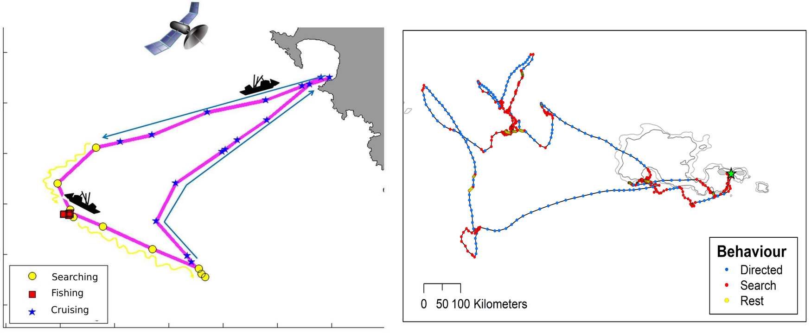
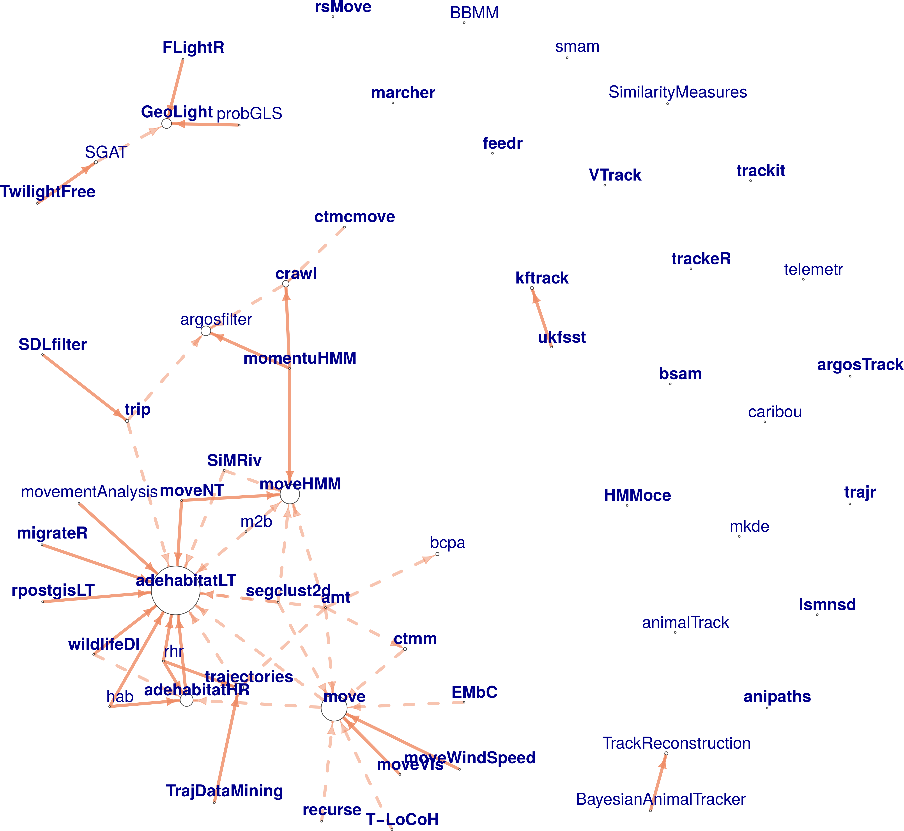

## Statistical methods to study movement

### Identifying behaviors from tracking data

Tracking devices allow us to follow the movement of humans and animals, in many
cases around the globe. Because we can often record movement but not the
behaviors behind them, we expect that the movement (or the absence of movement)
patterns will provide information to identify these behaviors. For fisheries,
identifying the behavioral modes or activities performed during fishing trips
leads to better quantification of the spatial effort deployed, which can serve
as inputs for management decisions and even changing the fishing quota
(Poos, Quirijns, and Rijnsdorp 2010; Hornborg et al. 2017). In ecology, identification of behaviors in animal
trajectories facilitates assessing changes in migration or foraging strategies
and deployment of effort. If those changes are associated with recognizable
anthropogenic or environmental effects, this could lead to changes in
conservation strategies.

Throughout my research, I have used different methods to identify behavioral
patterns from tracking data: machine learning techniques (random forests,
artificial neural networks, support vector machines) and Markovian models
(hidden Markov and hidden semi-Markov models; HMMs and HSMMs, respectively); in
some cases, I combined the two to make hybrid models (e.g. random forests
embedded into hidden Markov structures; Rocio Joo (2013); Maufroy et al. (2015)).

#### Machine learning

The machine learning techniques I used were calibrated and validated in a
supervised framework, in cases where groundtruthed data were available. These
were fisheries where observers on-board a sample of fishing vessels registered
when fishing sets or other types of activities were performed, like the Peruvian
purse-seine anchovy fishery (Rocio Joo 2009; Rocío Joo et al. 2011; Rocio Joo et al. 2013), and the Mexican
Yucatan fishery (Torres-Irineo et al.). In the Mexican fishery, this work was a primer for
their small-scale fisheries to show the potential of analyzing tracking data to
infer fishing sets and quantify the fishing effort. Artisanal fisheries –
worldwide – are poorly regulated, hence the relevance of this initiative. In the
Peruvian fishery, the Vessel Monitoring System (VMS) data was already being used
to infer fishing sets; however, the official method at the time – as in many
other fisheries in the world – was a speed threshold. The overestimation of the
number of fishing sets was \~182% with the speed threshold (S. Bertrand, Diaz, and Lengaigne (2008)), and
was reduced to \~1% when using neural networks instead (Rocío Joo et al. (2011)). In order to
get the method used in a daily basis by the Instituto del Mar del Perú (IMARPE),
I first designed a graphic interface in Matlab, and when the pelagic fisheries
department switched to R, I translated all codes to R.

#### Markovian models

HMMs and HSMMs take into account the sequential nature of the tracking data
through transition probabilities – and dwell-time probabilities, in the case of
HSMMs. I fitted HMMs and HSMMs in a supervised framework for the Peruvian
purse-seine fishery, and found that, when the goal is to infer not only fishing
but several types of activities performed in a fishing trip (e.g. searching for
fish, cruising), and the time spent in each activity, the Markovian models did a
better job than machine learning methods (\~80% of global accuracy; Rocio Joo et al. (2013)).
For this case, I modified the equations and algorithms in HSMMs to work with the
irregular time steps that the VMS data contained (Rocio Joo 2013). Because it is
actually unusual to have groundtruthed data of behavioral modes (e.g. on-board
data in fisheries science, or video data in animal ecology), Markovian models
are commonly used in a non-supervised framework, with Expectation-Maximization
algorithms for parameter estimation. Using the on-board observer data collected
by IMARPE, I evaluated HMMs within supervised and non-supervised frameworks, and
showed that, for the Peruvian anchovy fishing trips, the supervised method (i.e.
parameter estimation using groundtruthed data) provided better results than the
non-supervised one (+10% accuracy for fishing and +25% for searching
activities). Results are sensitive to the number of tracks with on-board data
(presented at a statistical ecology conference as Rocio Joo et al. (2014)). These findings
highlight the importance of on-board observers programs in fisheries to
accurately estimate fishing spatial effort, and for animal ecology, that there
should be more effort into recording groundtruthed behavioral data.

Figure 1: Inferred behavioral modes. Left panel: fishing vessel track (Joo et al. 2013). Right panel: seabird track (Clay et al. 2020).

In settings where groundtruthed data was non-existent, we worked with
non-supervised Markovian models. These were artisanal fisheries in the
North-East of Brazil (HSMMs; Santos Da Silva (2017), supervision of Bachelor thesis,
main advisor M. Thomé de Souza), and seabird foraging trips in Crozet and South
Georgia islands (HMMs; Clay et al. (2020)). For the artisanal fisheries in Brazil, the
goal was the same as in the Mexican case, to show the potential of analyzing
tracking data to infer fishing activities and quantify the fishing effort. In
case of seabirds, and more specifically, wandering albatrosses, we investigated
the role of wind in their behavior (e.g. resting, searching, traveling) during
foraging trips. We showed that wind plays an important role in their decisions
to take off (from resting to traveling), and in the differences in routes that
females and males choose. Wind conditions are likely to be altered in climate
change scenarios, and could have drastic consequences in the fitness and
survival of this soaring species.

#### Hybrid models

Hybrid models (HSMM-neural-networks and HSMM-random-forests) were implemented
for the Peruvian purse-seine fishery and the floating artificial devices (FADs)
in the French tuna fishery, respectively. I implemented a hybrid
HSMM-random-forest model on trajectory data from FADs to identify segments of
their tracks corresponding to being on vessels, and matched those with the VMS
data to identify these vessels. The model provided 97% of accuracy. Part of that
work was published in Maufroy et al. (2015).

### Multivariate analysis and geostatistics for fishing spatial effort

A mix of multivariate methods (e.g. principal components, coinertia,
hierarchical clustering) allowed me to identify tactics and strategies in the
Peruvian industrial anchovy fishery, and their associations to abiotic and
biotic conditions (e.g. fish spatial distribution and abundance, sea surface
temperature, oxycline depth, El Niño Southern Oscillation) as well as
characteristics of the vessels and the fishers themselves (Rocio Joo et al. 2014, 2015).
For those studies, data from multiple sources were used (on-board observers, raw
VMS data, behavioral modes obtained with HSMMs, acoustic data from scientific
surveys and satellite data). It required interdisciplinary work with
oceanographers, biologists and ecologists to understand the data and the
processes in the ecosystem.

Figure 2: Idealized 3D representation of ecological conditions in a given scenario, and associations with fishers spatial behavior (Joo et al. 2014).

Spatial effort from a predator can be indicative of the relative abundance and
spatial distribution of their prey. With that in mind, I used the behavioral
mode information from anchovy fishers to build a proxy of anchovy presence. The
activities were aggregated in space and time (cells of \~25 km, 1 month) and used
for variogram fitting and kriging interpolation to obtain anchovy presence maps
(Rocio Joo 2013). Spatial descriptors were used to compare these maps to maps made
from acoustic biomass of anchovy from concomitant scientific surveys. Positive
spatial covariations between the two random fields were obtained at coarse
scales, but no conclusive results were observed for fine scales (Camasca Olivari 2016).

### Estimating sampling effort to monitor the fishery

In IMARPE, the number of on-board observers per fishing season depended
exclusively on the available budget and arbitrary decisions. They needed a
robust methodology to decide on the number of observers. I developed a
methodology based on simulations and resampling to assess the sensitivity of the
indicators used for monitoring the fishery (e.g. catch sizes, percentage of
juveniles, discards) calculated from on-board observations to the number of
sampled fishing trips, thus indirectly to the number of observers. The procedure
was applied to the Peruvian anchovy fishery to estimate the number of observers
necessary to obtain small confidence intervals, and it can be applied to other
fisheries. This study was published in Spanish in order to make the methodology
more accessible to the Peruvian colleagues (Rocío Joo et al. 2016). I also performed a
sensitivity analysis to recommend how many individuals to sample during fishing
activities in order to estimate the capture sizes of the whole fishing sets
(Rocío Joo et al. 2017).

### A generalized approach to the random walk debate for human and animal movement

There have been (and still are) multiple debates about the choice of the best
random walk model for trajectories of organisms; mainly between Brownian motion
and Lévy walk supporters. Generally speaking, the methodological (empirical)
part of the debate consisted in comparing the goodness-of-fit of the tail of the
distribution of step lengths to Gaussian or power law distributions
(corresponding to Brownian and Lévy, respectively). Instead of comparing two
possibilities, in Sophie Bertrand, Joo, and Fablet (2015), we proposed an approach that allowed the most
plausible model emerge from the data, fitting the tail of the distribution of
step lengths to a Generalized Pareto distribution that included Gaussian and
power law as particular cases. The method was applied to Peruvian fishing vessel
and seabird tracking data. The estimated parameters of scale and diffusion from
the Generalized Pareto distribution provided information on the foraging
strategies of each individual.

Figure 3: Generalized Pareto Distribution, a continuum from Exponential-Poisson to Power-Lévy walk patterns: parameter k of the Generalized Pareto distribution defines a continuum of distributions from light-tailed (k&lt;0) to heavy-tailed (k&gt;0.5). (Bertrand et al. 2015).

### Metrics for assessing dyadic movement

From a review of collective movement literature, I identified that most
data-driven works have relied on metrics that were not measuring what was
intended, probably due to an absence of investigations on the theoretical
properties of those metrics. For this reason, we investigated the adequacy of
twelve metrics introduced in the literature for assessing joint movement by
analyzing their theoretical properties and confronting them with contrasting
case scenarios. Two criteria were taken into account for review of those
metrics: 1) practical use, and 2) dependence on parameters and underlying
assumptions. We also evaluated the ability of each metric to assess specific
aspects of joint-movement behavior: proximity (closeness in space-time) and
coordination (synchrony) in direction and speed. We found that some metrics are
better suited to assess proximity and others are more sensitive to coordination
(Rocío Joo et al. 2018).

Figure 4: Representation of metrics in terms of their distance relative to proximity and coordination obtaining by studying their mathematical properties. (Joo et al. 2018).

## Software packages to process and analyze movement data

R is the most used software platform in ecology (Lai et al. 2019). For
processing/analyzing tracking data alone, there are already 58 R packages. With
so many packages, users and even developers have not been able to track them
all, choose the most pertinent to use for their analyses, and, in some cases,
developers duplicated work without realizing it already existed. For these
reasons, we reviewed the 58 tracking packages and a few more that were related
to other movement data (e.g. accelerometers). We described each package based on
a workflow centered around tracking data, broken down in three stages:
pre-processing, post-processing and analysis (data visualization, track
description, path reconstruction, behavioral pattern identification, space use
characterization, trajectory simulation and others) (Rocío Joo, Boone, et al. 2020). Links between
packages were assessed through a network graph analysis and showed that one
third of the packages worked on isolation, reflecting a fragmentation in the R
movement-ecology programming community. We also provided recommendations for
users to choose packages and for developers to maximize the usefulness of their
contribution and strengthen the links between the programming community.
Throughout this investigation we came to the realization that there is still a
need for standardized R data classes for trajectory data. We are currently
working on an R package with data classes to handle tracking data, and later
connect it to the other tracking packages. This work is funded by the R
Consortium. Furthermore, since R packages are dynamic (i.e. new packages are
created, old packages get updated and some even disappear or get deprecated due
to lack of maintenance), to keep updating the list in Rocío Joo, Boone, et al. (2020), we created a
[CRAN Task View](https://cran.r-project.org/web/views/Tracking.html), that will
be updated every 6 months.

Figure 5: Network representation of the dependency and suggestion between tracking packages. The arrows go towards the package the others suggest (dashed arrows) or depend on (solid arrows). Bold font corresponds to active packages. The size of the circle is proportional to the number of packages that suggest or depend on this one (Joo et al. 2020).

## A text mining approach to review the field of movement ecology

The field of movement ecology has experienced unprecedented growth in the last decade: technological advances have enabled a wide range of sensors to be used by ecologists, and analytical and programming tools have been developed to aid data processing and analysis. Aiming at a comprehensive view of the state of the field, I am currently leading a synthetic and quantitative review of the scientific publications in movement ecology (Rocío Joo, Picardi, et al. 2020). We focused on the ten-year time span between the formal introduction of the movement ecology framework (MEF) by Nathan et al. (2008) and the end of 2018. We searched the Web of Science and obtained a database of 8007 peer-reviewed papers. We then used a text mining approach to extract text from the publications, evaluate the impact of the MEF in the literature, and assess changes in the use of technological devices, software and statistical methods. We also used Latent Dirichlet Allocation models to model the research topics in the field. We found that, while there have been major technological changes in the last decade (i.e. more use of GPS devices, accelerometers and video cameras, and a convergence towards the use of R), the focus remains on the same research questions, and more specifically, on the effect of external factors such as the environment on movement and behavior. In practice, the comprehensive approach from the MEF has not been integrated into movement ecology research. We call on researchers in movement ecology to transform the field from technology-driven to truly interdisciplinary and embracing the MEF.

Stay tuned for more!

## References

Bertrand, S, E Diaz, and M Lengaigne. 2008. “Patterns in the spatial distribution of Peruvian anchovy *(Engraulis ringens)* revealed by spatially explicit fishing data.” *Progress In Oceanography* 79 (2-4): 379–89. <https://doi.org/10.1016/j.pocean.2008.10.009>.

Bertrand, Sophie, Rocío Joo, and Ronan Fablet. 2015. “Generalized Pareto for Pattern-Oriented Random Walk Modelling of Organisms’ Movements.” *PloS One* 10 (7): e0132231. <https://doi.org/10.1371/journal.pone.0132231>.

Camasca Olivari, Rommy. 2016. “Comparación de Patrones de Campos Aleatorios Modelados Bajo Un Enfoque Geoestadístico: Una Aplicación En La Ecología Pesquera.” Bachelor thesis, Universidad Nacional de Ingeniería.

Clay, Thomas A., Rocío Joo, Henri Weimerskirch, Richard A. Phillips, Olivier den Ouden, Mathieu Basille, Susana Clusella‐Trullas, Jelle D. Assink, and Samantha C. Patrick. 2020. “Sex-Specific Effects of Wind on the Flight Decisions of a Sexually Dimorphic Soaring Bird.” *Journal of Animal Ecology* 89 (8): 1811–23. <https://doi.org/10.1111/1365-2656.13267>.

Hornborg, Sara, Patrik Jonsson, Mattias Sköld, Mats Ulmestrand, Daniel Valentinsson, Ole Ritzau Eigaard, Jordan Feekings, J. Rasmus Nielsen, Francois Bastardie, and Johan Lövgren. 2017. “New Policies May Call for New Approaches: The Case of the Swedish Norway Lobster (Nephrops Norvegicus) Fisheries in the Kattegat and Skagerrak.” *ICES Journal of Marine Science* 74 (1): 134–45. <https://doi.org/10.1093/icesjms/fsw153>.

Joo, Rocio. 2009. “Identificación de Puntos de Pesca En Los Viajes Pesqueros de Anchoveta Monitoreados Por Satélite Mediante Redes Neuronales Artificiales.” Bachelor thesis, Universidad Nacional de Ingeniería.

———. 2013. “A Behavioral Ecology of Fishermen: Hidden Stories from Trajectory Data in the Northern Humboldt Current System.” PhD thesis, École Doctorale SIBAGHE - Systèmes intégrés en Biologie, Agronomie, Géosciences, Hydrosciences et Environnement.

Joo, Rocio, Arnaud Bertrand, Marilu Bouchon, Alexis Chaigneau, Hervé Demarcq, Jorge Tam, Monique Simier, et al. 2014. “Ecosystem scenarios shape fishing spatial behavior. The case of the anchovy fishery in the northern Humboldt Current system.” *Progress in Oceanography* 128: 60–73.

Joo, Rocio, Sophie Bertrand, Jorge Tam, and Ronan Fablet. 2013. “Hidden Markov models: the best models for forager movements?” *PLOS ONE* 8 (8): e71246.

Joo, Rocio, Omar Salcedo, Mariano Gutierrez, Ronan Fablet, and Sophie Bertrand. 2015. “Defining fishing spatial strategies from VMS data: Insights from the world’s largest monospecific fishery.” *Fisheries Research* 164: 223–30. <https://doi.org/10.1016/j.fishres.2014.12.004>.

Joo, Rocío, Sophie Bertrand, Alexis Chaigneau, and Miguel Ñiquen. 2011. “Optimization of an artificial neural network for identifying fishing set positions from VMS data: An example from the Peruvian anchovy purse seine fishery.” *Ecological Modelling* 222: 1048–59. <https://doi.org/10.1016/j.ecolmodel.2010.08.039>.

Joo, Rocío, Matthew E. Boone, Thomas A. Clay, Samantha C. Patrick, Susana Clusella‐Trullas, and Mathieu Basille. 2020. “Navigating Through the r Packages for Movement.” *Journal of Animal Ecology* 89 (1): 248–67. <https://doi.org/10.1111/1365-2656.13116>.

Joo, Rocío, Marie-Pierre Etienne, Nicolas Bez, and Stéphanie Mahévas. 2018. “Metrics for Describing Dyadic Movement: A Review.” *Movement Ecology* 6 (1): 26. <https://doi.org/10.1186/s40462-018-0144-2>.

Joo, Rocío, Daniel Grados, Marilú Bouchon, and Erich Díaz. 2016. “Tamaño óptimo de Muestra Del Programa de Observadores a Bordo de La Flota Dirigida a La Explotación de La Anchoveta Peruana (Engraulis Ringens).” *Revista Peruana de Biología* 23: 169–82.

———. 2017. “Tamaño óptimo de Muestra Para Estimar La Distribución de Tallas y Proporción de Juveniles de Anchoveta Por Lance a Bordo de La Flota de Cerco Peruana.” *Revista Peruana de Biología* 23: 059–66.

Joo, Rocío, Simona Picardi, Matthew E. Boone, Thomas A. Clay, Samantha C. Patrick, Vilma S. Romero-Romero, and Mathieu Basille. 2020. “A Decade of Movement Ecology.” *arXiv:2006.00110 \[q-Bio\]*, May. <http://arxiv.org/abs/2006.00110>.

Lai, Jiangshan, Christopher J. Lortie, Robert A. Muenchen, Jian Yang, and Keping Ma. 2019. “Evaluating the Popularity of R in Ecology.” *Ecosphere* 10 (1): e02567. <https://doi.org/10.1002/ecs2.2567>.

Maufroy, Alexandra, Emmanuel Chassot, Rocío Joo, and David Michael Kaplan. 2015. “Large-Scale Examination of Spatio-Temporal Patterns of Drifting Fish Aggregating Devices (dFADs) from Tropical Tuna Fisheries of the Indian and Atlantic Oceans.” *PloS One* 10 (5): e0128023. <https://doi.org/10.1371/journal.pone.0128023>.

Nathan, R, W M Getz, E Revilla, M Holyoak, R Kadmon, D Saltz, and P E Smouse. 2008. “A movement ecology paradigm for unifying organismal movement research.” *PNAS* 105 (49): 19052–59.

Poos, Jan-Jaap, F J Quirijns, and A D Rijnsdorp. 2010. “Spatial segregation among fishing vessels in a multispecies fishery.” *ICES Journal of Marine Science* 67: 155–64.

Santos Da Silva, Icaro. 2017. “Padrões de Deslocamentos Da Embarcação Pesqueira Do Tipo Canoa de Mar Aberto Na Costa de Sergipe, Brasil.” Bachelor thesis, Universidade Federal de Sergipe.

Torres-Irineo, Edgar, Silvia Salas, Jorge Iván Euán-Ávila, Leopoldo E. Palomo, Daniel R. Quijano Quiñones, Eva Coronado, and Rocio Joo. “Spatio-Temporal Determination of Small-Scale Vessels’ Fishing Grounds from a Vessel Monitoring System in the Southeastern Gulf of Mexico.” *In Review*.

